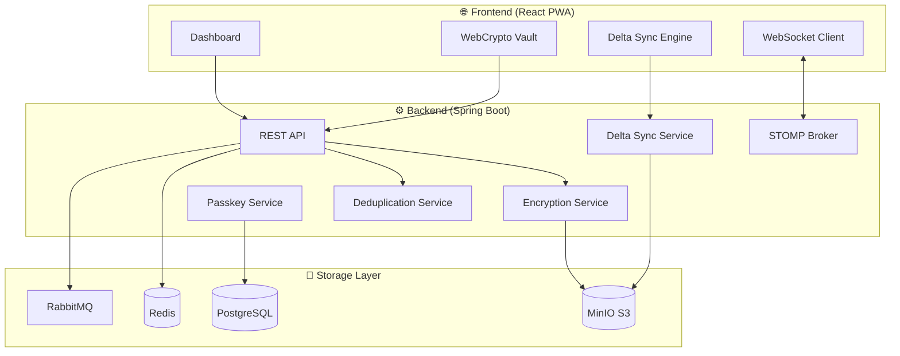

# SanchayCloud: Zero-Knowledge Cloud Storage Engine

    

**SanchayCloud** is a production-grade cloud storage platform with **Zero-Knowledge Encryption**, **Delta Sync**, **File Versioning**, and **Passwordless Authentication**.

> 🔐 Your files are encrypted in your browser. We never see your data.

---

## ✨ What Makes SanchayCloud Different

| Feature | Traditional Cloud | SanchayCloud |
|---------|-------------------|--------------|
| **Encryption** | Server-side (provider sees data) | Client-side AES-256-GCM (zero-knowledge) |
| **File Updates** | Re-upload entire file | Delta sync (only changed bytes) |
| **Duplicates** | Stored multiple times | Global deduplication |
| **Authentication** | Passwords | Passkeys (Face ID / Touch ID) |
| **Sync** | Polling / manual refresh | Real-time WebSocket |

---

## 🏗 Architecture



---

## 🚀 Key Features

### 🔐 Zero-Knowledge Vault Encryption
- Files encrypted with **AES-256-GCM** in your browser before upload
- Encryption key derived from your password using **PBKDF2** (100,000 iterations)
- Server never sees plaintext or keys

### ⚡ Delta Sync (Rsync-style)
- Edit 1 byte in a 100MB file → upload only ~4KB
- Rolling hash algorithm detects changed blocks
- **99%+ bandwidth savings** on file updates

### 🔗 Global Deduplication
- 100 users upload same file → stored once
- Uses **convergent encryption** for security
- 30-50% storage cost reduction at scale

### 🔑 Passkeys (WebAuthn)
- Passwordless login with Face ID / Touch ID / Windows Hello
- Phishing-resistant (cryptographically bound to origin)
- No passwords to leak or remember

### 📝 File Versioning
- Never lose previous versions
- MinIO native bucket versioning
- One-click restore to any version

### ⚡ Real-Time Sync
- WebSocket (STOMP) for instant updates
- Upload on one device → appears on all devices
- No page refresh needed

### 📱 Progressive Web App
- Install on desktop/mobile
- Offline-capable with service worker caching
- Native app experience

---

## 🛠 Tech Stack

| Layer | Technology |
|-------|------------|
| **Frontend** | React 19, Framer Motion, Tailwind CSS |
| **Backend** | Java 21, Spring Boot 3.4, Spring WebSocket |
| **Database** | PostgreSQL 15 |
| **Object Storage** | MinIO (S3 Compatible, Versioned) |
| **Cache** | Redis |
| **Message Queue** | RabbitMQ |
| **Auth** | JWT + WebAuthn/Passkeys |
| **Encryption** | AES-256-GCM, PBKDF2, WebCrypto API |

---

## ⚡ Quick Start

### Prerequisites
- Docker & Docker Compose
- Java 21 SDK
- Node.js 18+

### 1. Start Infrastructure

```bash
docker-compose up -d
```

Services:
- **MinIO Console**: http://localhost:9001 (`minioadmin` / `minioadmin`)
- **RabbitMQ**: http://localhost:15672 (`guest` / `guest`)

### 2. Start Backend

```bash
cd backend
mvn clean install -DskipTests
java -jar target/SanchayCloud-1.0-SNAPSHOT.jar
```

API: http://localhost:8080

### 3. Start Frontend

```bash
cd frontend
npm install
npm start
```

App: http://localhost:3000

---

## 📁 Project Structure

```
SanchayCloud/
├── backend/
│   ├── src/main/java/com/minidrive/
│   │   ├── api/                # REST Controllers
│   │   ├── auth/               # JWT + Passkey Auth
│   │   ├── config/             # WebSocket, Security
│   │   ├── service/            # Core Business Logic
│   │   │   ├── DeltaSyncService.java
│   │   │   ├── DeduplicationService.java
│   │   │   ├── EncryptionService.java
│   │   │   └── PasskeyService.java
│   │   ├── storage/            # MinIO Integration
│   │   └── repository/         # PostgreSQL Repos
│   └── pom.xml
├── frontend/
│   ├── public/
│   │   ├── manifest.json       # PWA Manifest
│   │   └── service-worker.js   # Offline Caching
│   ├── src/
│   │   ├── hooks/
│   │   │   ├── useDriveWebSocket.js
│   │   │   ├── useDeltaUpload.js
│   │   │   ├── useVaultUpload.js
│   │   │   └── usePasskey.js
│   │   ├── utils/
│   │   │   ├── VaultCrypto.js  # WebCrypto AES-256
│   │   │   └── DeltaSync.js    # Rolling Hash
│   │   └── components/
│   └── package.json
└── docker-compose.yml
```

---

## 🔒 Security Model

```
┌─────────────────────────────────────────────────────────┐
│                    CLIENT (Browser)                     │
│  ┌─────────────┐    ┌─────────────┐    ┌─────────────┐ │
│  │  Plaintext  │───▶│ AES-256-GCM │───▶│ Ciphertext  │ │
│  │    File     │    │  (WebCrypto)│    │   + Salt    │ │
│  └─────────────┘    └─────────────┘    └─────────────┘ │
│         │                                     │         │
│         ▼                                     ▼         │
│  ┌─────────────┐                      ┌─────────────┐  │
│  │   Password  │──PBKDF2 (100k)──────▶│     Key     │  │
│  └─────────────┘                      └─────────────┘  │
└─────────────────────────────────────────────────────────┘
                           │
                           ▼ (Encrypted Only)
┌─────────────────────────────────────────────────────────┐
│                       SERVER                             │
│         Cannot decrypt. Zero-knowledge by design.        │
└─────────────────────────────────────────────────────────┘
```

---

## 📜 License

MIT License - see [LICENSE](LICENSE)

---

## 🙏 Acknowledgments

Built with ❤️ by Vandan